# CARE :  Integrated Health System (IHS)
## Complete System Design Document

**Version:** 1.0 :  Design phase (no implementation)
**Author:** Ahmed Eldaly
**Date:** September 2026

---

## Table of Contents

1. [Vision & Problem Statement](#1-vision--problem-statement)
2. [Scope & Goals](#2-scope--goals)
3. [Actors & Roles](#3-actors--roles)
4. [System Architecture](#4-system-architecture)
5. [Core Engines](#5-core-engines)
6. [The IoT Device Standard (CARE Device Protocol)](#6-the-iot-device-standard-care-device-protocol)
7. [Privacy Model & Confidential Diagnosis](#7-privacy-model--confidential-diagnosis)
8. [Data Model (ERD)](#8-data-model-erd)
9. [Use Cases & Flows :  Complete Catalog](#9-use-cases--flows--complete-catalog)
10. [State Machines](#10-state-machines)
11. [Edge Cases & Failure Modes](#11-edge-cases--failure-modes)
12. [Non-Functional Requirements](#12-non-functional-requirements)
13. [Design Decisions Log](#13-design-decisions-log)
14. [Future Work](#14-future-work)

---

## 1. Vision & Problem Statement

Healthcare systems and emergency-response systems are traditionally **two separate worlds**. A hospital knows a patient's history but has no idea an ambulance is 4 minutes away carrying them. Civil defense dispatches an ambulance to a cardiac arrest without knowing the patient is diabetic, allergic to penicillin, and wears a connected heart monitor that flagged the arrhythmia 90 seconds before collapse.

**CARE (Connected Ambulance–Records–Emergency)** is an Integrated Health System (IHS) that fuses these worlds into one platform built on three pillars:

1. **Continuous care** :  a unified electronic health record (EHR) fed live by patient IoT devices, connecting patients, relatives, doctors, clinics, and hospitals.
2. **Intelligent assistance** :  a trained AI model that sees the *full* patient context (record + live vitals + presenting complaint) and produces a preliminary diagnosis and risk score **as decision support for clinicians**, never as an autonomous final decision.
3. **Emergency integration** :  civil defense dispatch, ambulance routing (including smart-city traffic coordination), real-time hospital capacity, and mass-casualty coordination, all reading from and writing to the same data core.

The system's defining property: **the same data and the same triage logic serve everyday care and disaster response.** There is no "emergency copy" of the patient :  the ambulance, the ER, and the family doctor all see one record, filtered by permissions.

---

## 2. Scope & Goals

### In scope (this design)

| Area | Included |
|---|---|
| Patient care | Unified EHR, follow-ups, IoT monitoring, appointment booking, self-triage |
| Clinical tools | Doctor workspace, e-prescriptions, drug-interaction & complication alerts (CDS), diagnosis-assist AI |
| Hospital ops | Bed/capacity management, staff allocation, pre-arrival notification, diagnostic support |
| Emergency | SOS (manual + automatic), civil-defense dispatch console, ambulance routing, smart-city traffic corridor, mass-casualty incident (MCI) coordination |
| Privacy | Role-based access, confidential-diagnosis restriction, break-glass with audit |
| IoT | Open device protocol (vendor-agnostic), device gateway, anomaly detection |

### Out of scope (explicitly)

- Building physical IoT hardware (CARE defines the **standard**; vendors build devices)
- Insurance/billing systems
- Pharmacy inventory & supply chain
- Full autonomous AI diagnosis (deliberately excluded :  see §5.2 and §13)
- National ID / government identity infrastructure (assumed to exist as an external service)

### Goals (measurable)

| # | Goal | Target |
|---|---|---|
| G1 | Time from SOS trigger to ambulance dispatch decision | < 60 seconds |
| G2 | Hospital pre-arrival notice before ambulance arrives | ≥ 5 minutes when transport ≥ 5 min |
| G3 | Capacity registry freshness | Bed states < 2 minutes stale |
| G4 | Drug-interaction check on every prescription | 100% coverage |
| G5 | Break-glass accesses audited | 100%, immutable log |
| G6 | Any compliant vendor device onboarded | No CARE code changes required |

---

## 3. Actors & Roles

### 3.1 Patient

The center of the system. Capabilities:

- **Own record** :  views their full EHR: history, lab results, medications, allergies, imaging, visit notes (subject to clinician-sealed notes, §7).
- **IoT monitoring** :  pairs any CARE-compliant device (cardiac, respiratory, gastric, auditory, glucose, fall-detection, etc.). Vitals stream into the record continuously.
- **Care circle** :  invites relatives/caregivers and doctors to follow their status. Each member gets a *permission tier* (see §7.2) :  e.g., a daughter sees "status: stable / alert raised," not the full psychiatric history.
- **Booking** :  searches clinics/doctors, books appointments, receives reminders.
- **SOS** :  one-tap emergency call that ships their identity, location, live vitals, and record summary to dispatch. Also triggered *automatically* by IoT anomaly rules (e.g., fall + no response in 30 s).
- **Self-triage** :  describes symptoms; the triage engine returns urgency level and recommended action (self-care / book GP / urgent care / call ambulance). This is the *same* engine dispatch uses (§5.1).
- **Ambulance coordination** :  when an ambulance is en route, the patient (or bystander) sees live ETA, and the smart-city corridor is coordinated (§9, UC-08).

### 3.2 Doctor

- **Clinic management** :  schedule, appointment queue, patient roster.
- **Consultation workspace** :  full patient record (per permissions), live IoT charts, visit notes.
- **Diagnosis** :  records diagnoses (ICD-coded). May consult the **diagnosis-assist model**: it presents a *ranked differential* (list of candidate diagnoses with confidence and supporting evidence). **The doctor always makes the final call** (Design Decision D1, §13).
- **e-Prescription with CDS** :  on every prescription the Clinical Decision Support layer checks: drug–drug interactions, drug–allergy conflicts, drug–condition contraindications (e.g., NSAID + renal failure), dosage vs. age/weight, and duplicate therapy. Alerts are tiered: *info → warning → hard-stop* (hard-stop requires an override reason, which is logged).
- **Complication watch** :  for post-operative or chronic patients, the doctor sets watch rules on IoT streams ("alert me if SpO₂ < 92% for 5 min") and receives escalations.
- **Procedure support** :  during operations/examinations, the assist model surfaces relevant record facts (allergies, anticoagulant use, prior imaging) and monitors intra-op vitals against the patient's own baseline.

### 3.3 Hospital / Clinic (Organization role)

- **Capacity management** :  beds by type (ER, ICU, ward, isolation), operating rooms, key equipment (ventilators), specialist availability. Feeds the **Capacity Registry** (§5.4).
- **Staff allocation** :  assign doctors/nurses to departments and shifts; the dispatch layer reads specialist availability when routing patients.
- **Admissions & pre-arrival** :  receives structured pre-arrival packets for incoming ambulances: triage level, chief complaint, vitals trend, record summary. Prepares bed + team before the doors open.
- **Diagnostic & medical-assistance services** :  labs, imaging; results flow back into the unified EHR automatically.
- **MCI mode** :  during a declared mass-casualty incident, the hospital reports *surge capacity* (how many red/yellow/green patients it can absorb) and receives distributed casualties (§9, UC-10).

### 3.4 Civil Defense Operator (Dispatch)

- **Alarm intake** :  receives SOS calls, IoT auto-alerts, and third-party reports (bystander calls) in one queue, pre-enriched with patient identity and vitals when available.
- **Triage & dispatch** :  the shared triage engine scores the case; the operator confirms/overrides and dispatches the *best* unit: nearest **suitable** ambulance (BLS vs. ALS) → toward the *best* hospital (capacity + specialty + distance), not merely the nearest one.
- **Smart-city corridor** :  for critical (red) transports, requests a green-light corridor from the traffic-management integration; falls back to GPS-optimized routing + vehicle alerts when the city API is unavailable (Design Decision D4, §13).
- **MCI command** :  opens an incident, assigns field teams, tracks START triage tags, distributes casualties across hospitals against live surge capacity, and monitors the live incident board.

### 3.5 Secondary actors

| Actor | Role in system |
|---|---|
| Relative / caregiver | Read-limited member of a patient's care circle; receives alerts |
| Paramedic (field) | Mobile app: receives case packet, updates status/vitals en route, applies MCI triage tags |
| Medical assistant | Views the AI's preliminary output during exams; prepares cases for the doctor |
| IoT vendor | Certifies devices against the CARE Device Protocol; no runtime role |
| Traffic management system (external) | Receives corridor requests; returns corridor grant/deny |
| System administrator | Org onboarding, role assignment, audit review |

---

## 4. System Architecture

### 4.1 Layered overview

The system is five horizontal layers plus one vertical cross-cutting layer (security/privacy) that wraps everything.

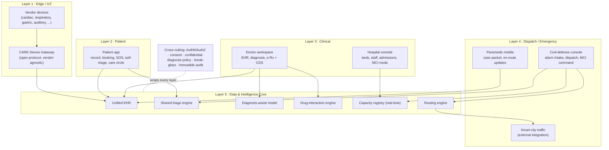

**Reading the diagram:** every layer talks to the **Data & Intelligence Core**, never directly to another layer's private storage. The doctor doesn't query the ambulance; both read/write the same case object in the core. This is what makes "one patient, one record, three contexts (home / clinic / ambulance)" possible.

### 4.2 Why one core instead of separate medical & emergency systems

| Property | Two systems (status quo) | CARE single core |
|---|---|---|
| Ambulance knows allergies | No (verbal handoff) | Yes (record summary in case packet) |
| Hospital prepped before arrival | Rarely (radio call) | Structured pre-arrival packet, automatic |
| Triage consistency | 3 different scoring habits | One engine, one score, three views |
| Capacity-aware routing | Dispatcher phones around | Live registry query |
| MCI casualty tracking | Paper tags + whiteboard | Digital tags + live board |
| Privacy | Ad-hoc | Central policy + break-glass audit |

### 4.3 High-level component communication

- **Streaming path (hot):** Device Gateway → vitals stream → anomaly rules → alert bus. Latency-sensitive; must work even when the rest of the platform is degraded.
- **Transactional path (warm):** bookings, prescriptions, admissions, capacity updates. Standard request/response with strong consistency for capacity reservations (a bed can't be promised to two ambulances).
- **Analytical path (cold):** model retraining data, incident retrospectives, population dashboards. Fully de-identified export (§7.5).

---
## 5. Core Engines

These five engines live in the Data & Intelligence Core and are shared by every layer. They are the heart of the system.

### 5.1 Shared Triage Engine

**One scoring function, three entry points.** The same model/ruleset computes urgency whether the input comes from:

1. the **patient** (self-triage: symptom questionnaire + live vitals),
2. **dispatch** (SOS/IoT alert: vitals + record + caller description),
3. the **hospital** (arrival re-triage: bedside measurements).

**Input:** structured symptoms (SNOMED-coded), live vitals with trend (not just last value), age, chronic conditions, medications, allergies, mechanism of injury (for trauma), consciousness level.

**Output:** urgency class on a 5-level scale mapped to standard ESI-like levels:

| Level | Color | Meaning | Default action |
|---|---|---|---|
| 1 | Red | Immediate life threat | ALS ambulance + corridor + resus bed |
| 2 | Orange | Emergent | Ambulance, ER notified |
| 3 | Yellow | Urgent | Urgent care / ER self-transport |
| 4 | Green | Less urgent | Book GP within 24–48 h |
| 5 | Blue | Non-urgent | Self-care guidance + optional booking |

Plus: confidence score, top contributing factors ("SpO₂ trend ↓ 6% over 20 min", "history of COPD"), and recommended resource type (BLS/ALS, specialty).

**Why shared matters:** if the patient app says level 2 and dispatch recomputes with richer data and gets level 1, the *delta and its reason* are shown :  the systems never silently disagree.

**Safety posture:** the engine can *escalate* autonomously (auto-raise an SOS from IoT), but can never *de-escalate* a human's judgment :  an operator or doctor can raise the level freely, but lowering it requires an explicit confirmation with reason.

### 5.2 Diagnosis-Assist Model

**What it is:** a trained model with access to the complete patient context :  full EHR, live and historical IoT streams, presenting complaint, and exam findings entered so far.

**What it produces (Design Decision D1):** a **ranked differential diagnosis list** :  typically top 5 candidates, each with:

- confidence (calibrated probability),
- supporting evidence *from this patient* ("elevated troponin 2019, current chest pain radiating to left arm, HR trend"),
- contradicting evidence ("normal ECG 10 min ago"),
- suggested confirmatory tests ranked by information gain vs. cost/invasiveness.

**What it is NOT:** an autonomous diagnostician. The output is addressed to the **medical assistant / doctor**; the human records the final diagnosis. The UI enforces this :  there is no path from model output to the record without a clinician's confirmation, and the record stores *both* (model suggestion + human decision) for later model evaluation.

**Three usage modes:**

| Mode | Context | Behavior |
|---|---|---|
| Consult | Clinic visit | Full differential + test suggestions |
| Exam-assist | During examination | Surfaces relevant record facts as the doctor enters findings ("patient on warfarin :  bleeding risk") |
| Procedure-assist | During operations | Monitors intra-op vitals against the patient's own baseline; flags deviations; keeps allergy/anticoagulant facts pinned on screen |

**Why this framing (rationale):** medico-legal defensibility (a decision-support tool is regulatorily and ethically tractable; an autonomous diagnostician is not), and quality (the human catches model blind spots; logged agree/disagree pairs continuously improve the model).

### 5.3 Drug-Interaction & Complication Engine (CDS)

Runs synchronously inside every prescription action and asynchronously as a record-watcher.

**Checks performed on e-Rx:**

1. Drug–drug interaction (against the patient's *active* medication list, including what other doctors prescribed :  this is a unified-record superpower).
2. Drug–allergy (including cross-reactivity classes).
3. Drug–condition contraindication (renal/hepatic function, pregnancy, G6PD, etc.).
4. Dose range vs. age/weight/renal function.
5. Duplicate therapy (same class from two prescribers).

**Alert tiers:** `info` (shown inline) → `warning` (must acknowledge) → `hard-stop` (must type an override justification; justification goes to the audit log and to the patient's primary doctor).

**Complication watch (async):** rules attached to conditions ("post-op day 1–3: fever > 38.5° + tachycardia → possible sepsis, alert surgeon") evaluated continuously against IoT + nursing entries.

### 5.4 Capacity Registry

The real-time source of truth for "who can take this patient right now."

**Tracked per facility:** beds by type (ER/resus, ICU, ward, isolation, pediatric), OR availability, ventilators, blood-bank status, specialist on-call roster, current ER load (patients waiting by triage level).

**Update paths (Design Decision D3 :  both):**

- **Adapter (preferred):** hospitals with an internal HIS connect through a Capacity Adapter (same philosophy as the IoT gateway :  CARE publishes the interface, the hospital's IT maps to it). Freshness: seconds.
- **Manual console (fallback):** charge nurse updates counts on a tablet; the registry stamps freshness and *decays trust* :  data older than 15 min is flagged stale and dispatch sees the timestamp.

**Reservation semantics:** when dispatch routes a red patient to Hospital X, the registry places a **hold** on a resus bed (TTL = ETA + 15 min). Holds are strongly consistent :  two ambulances cannot hold the same bed. If the hold expires (diverted, patient deceased), the bed auto-releases.

**MCI surge mode:** on incident declaration, every hospital in radius R is prompted to publish surge capacity (a coarser, faster commitment: "we can take 3 red / 10 yellow / 30 green in the next hour").

### 5.5 Routing Engine (+ Smart-City Integration)

**Two cooperating levels (Design Decision D4 :  both):**

1. **GPS routing (always on):** traffic-aware fastest path for ambulance → scene and scene → hospital; live ETA fed to the hospital pre-arrival packet and to the patient/relatives view.
2. **Smart-city corridor (when available and warranted):** for level-1/2 transports, CARE requests a signal-priority corridor from the city's traffic system along the planned route (green waves, intersection preemption). The integration is a *request/grant* protocol :  CARE never controls signals directly; the city system remains authoritative and may deny/partially grant. On deny or absence of the integration, level 1 falls back to routing + siren as today.

**Hospital selection is not "nearest":** score = f(ETA, capacity hold availability, specialty match, current ER load, MCI distribution rules). A burns case drives 8 extra minutes to the burns unit rather than 3 minutes to a hospital that would transfer it anyway.

---

## 6. The IoT Device Standard (CARE Device Protocol)

**Philosophy (Design Decision D2):** CARE builds **no devices**. It publishes an open protocol + certification suite; any vendor (cardiac monitors, respiratory, gastric/enteral, auditory, glucose, fall sensors, smart inhalers, ...) implements it and their device works with every CARE deployment.

### 6.1 Protocol layers

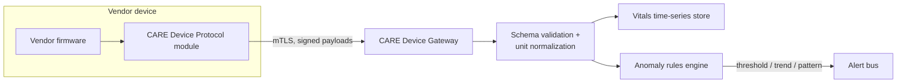

### 6.2 What the standard defines

| Section | Content |
|---|---|
| Identity & pairing | Device identity certificate; patient pairing via app (QR/NFC); revocation |
| Data model | Typed measurement schema (LOINC-coded observation types, units, sampling rate, quality flags) |
| Transport | Low-power streaming with store-and-forward for connectivity gaps; battery/status heartbeat |
| Security | mTLS device↔gateway, signed firmware attestation, per-device keys |
| Alert semantics | Devices may raise *device-local* alarms (e.g., lead-off, low battery) :  clinical alarms are computed server-side so logic is consistent across vendors |
| Certification | Conformance test suite vendors run to get listed as CARE-Compatible |

**Key design choice:** clinical anomaly detection is **server-side**, not on-device. A vendor's cheap sensor and a premium one feed the same rules engine, so a patient's safety doesn't depend on which brand they bought. Devices only self-report *technical* health.

### 6.3 Device categories (illustrative, extensible)

Cardiac (ECG patch, BP), Respiratory (SpO₂, respiratory rate, smart inhaler), Metabolic (CGM/glucose), Gastro/enteral (pH, feeding pumps), Auditory/neuro (hearing aids with fall/impact detection), Ambient (bed sensors, fall detection cameras :  event-only, no raw video leaves the home).

---

## 7. Privacy Model & Confidential Diagnosis

### 7.1 Principles

1. **The patient owns the record.** All sharing is consent-based and revocable, except narrow legal duties (infectious-disease reporting) which are surfaced to the patient, not hidden.
2. **Least privilege by default.** Every actor sees the minimum needed for their function.
3. **Emergency ≠ blanket access.** Emergencies widen access through a controlled, audited break-glass path :  never by turning permissions off.

### 7.2 Permission tiers (care circle & professionals)

| Tier | Typical holder | Sees |
|---|---|---|
| T0 Status | Distant relative | Online/offline, "alert raised", location during active emergency only |
| T1 Summary | Close caregiver | T0 + current conditions list (non-confidential), active alerts with vitals snapshot |
| T2 Clinical | Treating doctor | Full record **minus** sealed items not relevant to them (see 7.3) |
| T3 Full | Patient + explicitly granted clinicians (e.g., psychiatrist for psych records) | Everything in their sealed domain |
| E Emergency | Dispatch / paramedic / ER during an active case | Emergency Summary (7.4) + break-glass path |

### 7.3 Confidential (sealed) diagnoses

Certain diagnoses/record sections can be **sealed** :  by patient request or automatically by category (mental health, sexual/reproductive health, genetic results, HIV status, substance-use treatment).

- Sealed items are invisible at T1/T2 by default; the record shows a neutral "sealed section exists" marker to T2 clinicians (so they know to ask or break glass) :  **without revealing the category**.
- The patient can grant specific clinicians T3 for a specific sealed domain ("my psychiatrist sees psych; my dentist doesn't").
- **Safety override, always on:** the *pharmacological consequences* of sealed items are never sealed. If a sealed psychiatric medication interacts with a new prescription, the CDS fires a hard-stop that names the interaction **without naming the sealed diagnosis** ("interacts with an active medication :  contact patient's sealing physician or break glass").

### 7.4 Emergency Summary & Break-Glass (Design Decision D5)

**Emergency Summary** :  a pre-computed, always-available slice for tier E: blood type, allergies, active medications (names only), major conditions relevant to resuscitation (diabetes, epilepsy, anticoagulation, pacemaker), DNR/advance directives, emergency contacts. The patient reviews and can *add* to this slice; safety-critical fields (allergies, anticoagulants) cannot be removed from it.

**Break-glass** :  when the Emergency Summary is not enough:

- **Who can invoke:** (a) the treating physician on an active case, (b) the senior dispatch operator on an active case. Paramedics *request*; dispatch or the receiving physician approves (two-person rule for field requests).
- **Scope:** time-boxed (default 4 h, renewable while the case is open), case-bound (access dies when the case closes), and domain-scoped (opening cardiology history does not open psychiatric records unless separately justified).
- **Audit:** every break-glass writes an immutable log entry: who, when, which case, stated reason, exactly which items were viewed. The **patient is notified** after the emergency closes and can trigger a review; a privacy officer samples all break-glass events.

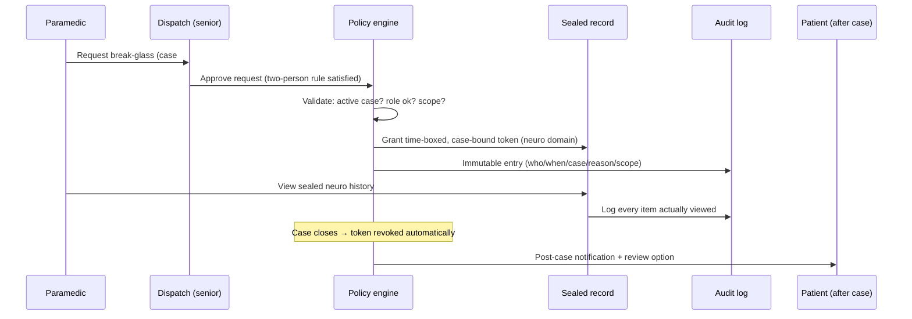

### 7.5 De-identified analytics

Model training and public-health dashboards use a separated pipeline: k-anonymized, sealed categories excluded by default, re-identification prohibited technically (no raw identifiers leave the clinical zone) and contractually.

---
## 8. Data Model (ERD)

The core entities and their relationships. (Attribute lists are representative, not exhaustive.)

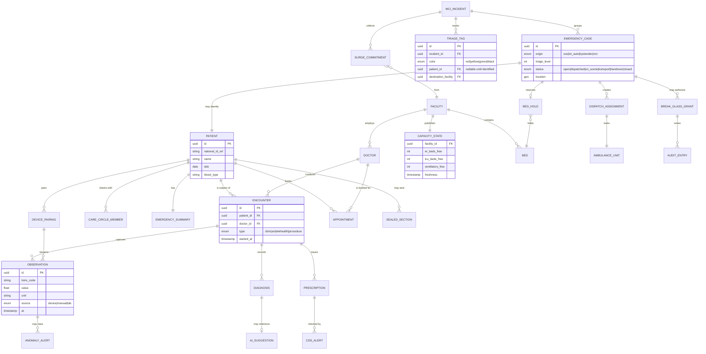

**Modeling notes:**

- `EMERGENCY_CASE.patient_id` is **nullable** :  a bystander can report an unidentified casualty; identity attaches later (ID scan, face-match opt-in, relative confirmation) and the record links retroactively.
- `AI_SUGGESTION` is stored *separately* from `DIAGNOSIS` and linked :  preserving the model-suggested vs. human-decided pair for audit and model evaluation (§5.2).
- `BED_HOLD` has a TTL and a single-holder constraint (§5.4).
- `TRIAGE_TAG` exists *before* a patient identity does :  in MCI, the tag (a QR wristband) is the primary key of the casualty until identification.

---

## 9. Use Cases & Flows :  Complete Catalog

Sixteen use cases across four groups. Each has a flow description; the structurally interesting ones have diagrams.

### Group A :  Everyday care

---

#### UC-01 · Patient onboarding & device pairing

1. Patient registers (identity verified against national ID service), completes health questionnaire.
2. Baseline record created; Emergency Summary auto-drafted from questionnaire; patient reviews it.
3. Patient buys any CARE-Compatible device → scans pairing QR in the app → device certificate validated → paired.
4. Gateway starts ingesting; first 48 h establish the patient's **personal baseline** (resting HR, SpO₂ range, sleep pattern) used by anomaly rules instead of population-only thresholds.

**Edge:** device fails certification handshake → pairing refused with vendor-support link; never "pair anyway."

---

#### UC-02 · Continuous IoT monitoring (steady state)

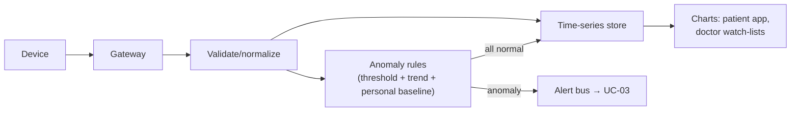

- Rules operate on **trends**, not single readings ("SpO₂ declining 6% over 20 min" beats "SpO₂ = 91 once").
- Data gaps are first-class: a silent device for > N minutes raises a *technical* alert (battery? removed?) at low urgency :  distinguished from clinical alerts.

---

#### UC-03 · IoT anomaly → graduated escalation

The most important everyday flow. Escalation is a ladder, not a jump to 911:

1. **Level A (info):** minor deviation → notify patient in-app ("your HR has been elevated for an hour :  feeling ok?"). Patient response ("exercising") closes it and *teaches the baseline*.
2. **Level B (concern):** sustained deviation or moderate pattern → notify patient + T1 care circle + flag on the treating doctor's watch-list.
3. **Level C (urgent):** dangerous pattern (arrhythmia signature, hypoglycemia trend) → triage engine scores it; if level ≤ 2 → **auto-open emergency case** in dispatch queue with a *challenge window*: the app rings the patient for 30 s ("Are you OK? Tap to cancel"). No response, or fall + no response → case proceeds as UC-07 with `origin=iot_auto`.
4. Every escalation carries the vitals window that caused it :  dispatch sees the *why*, not just "alarm."

**Edge :  false alarm handling:** patient cancels within the window → case closes as `false_alarm`, rule sensitivity for that pattern is reviewed; repeated false alarms auto-schedule a device-fit check rather than silently desensitizing.

---

#### UC-04 · Self-triage

1. Patient describes symptoms (guided, SNOMED-mapped) :  app merges live vitals automatically.
2. Shared triage engine returns level + explanation + action.
3. Actions wired end-to-end: level 4 → booking screen pre-filtered to suitable doctors; level 2 → "Call ambulance now" button that opens UC-07 with the triage context attached (dispatch does not start from zero).
4. Every self-triage is stored; if the patient books, the doctor sees what the engine said and why.

**Safety rule:** self-triage output never *discourages* seeking care ("you're probably fine") for red-flag symptom combinations :  those short-circuit to level ≤ 2 phrasing regardless of model confidence.

---

#### UC-05 · Appointment booking & follow-ups

1. Search by specialty/location/insurance; slots from doctor calendars; book/reschedule/cancel.
2. Reminders; pre-visit questionnaire attaches to the encounter.
3. Follow-up plans (post-op, chronic) generate recurring bookings + the IoT watch rules of §5.3.
4. No-show and overbooking policies are facility-configurable.

---

#### UC-06 · Doctor consultation, diagnosis & e-prescription (with CDS)

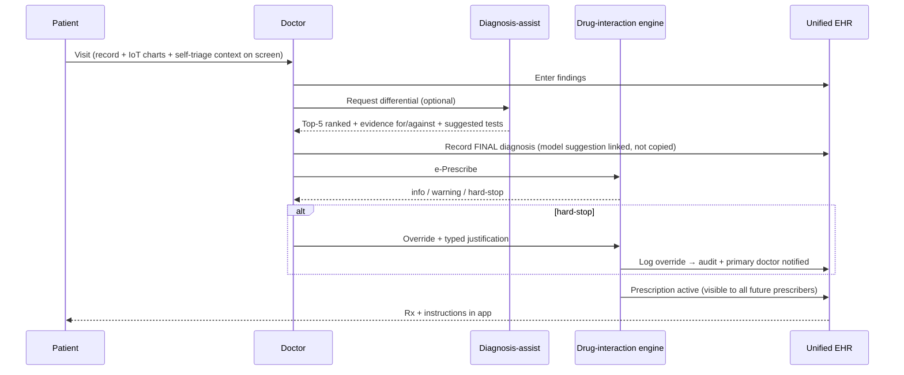

**The unified-record payoff:** the CDS checks against *everything active*, including prescriptions from other clinics :  the classic two-doctors-two-interacting-drugs failure becomes structurally impossible to miss.

---

### Group B :  Individual emergency

---

#### UC-07 · Individual emergency: SOS / IoT-auto / bystander (single flow, three origins)

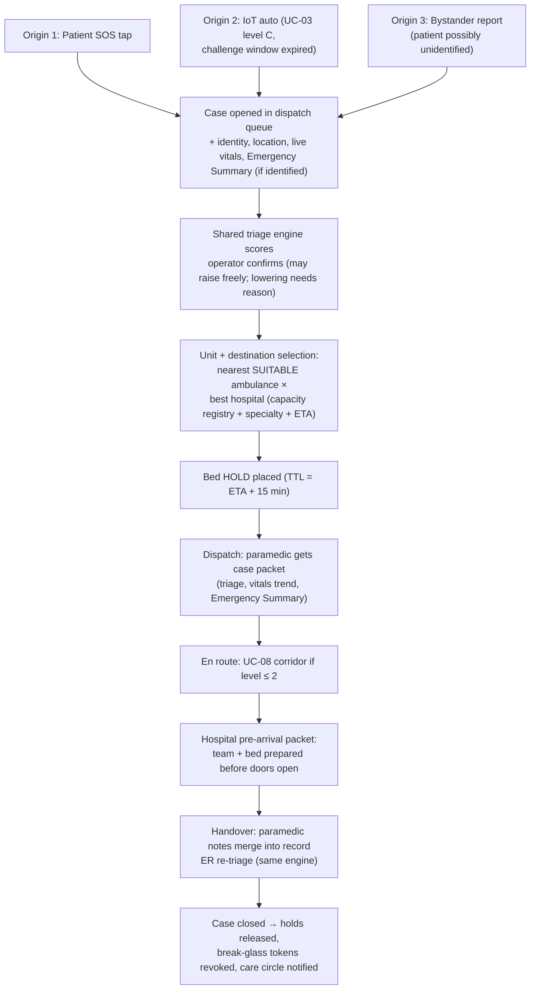

**Detail :  what the paramedic sees (case packet):** triage level + reasons, location, live vitals streamed from the patient's own devices *while driving to the scene* (they watch the patient deteriorate/stabilize before arrival), Emergency Summary, destination + bed hold confirmation, and the receiving team's names.

**Detail :  care circle during the case:** T1 members get "Emergency in progress :  ambulance ETA 6 min → City Hospital"; location sharing to T0/T1 activates *only* for the duration of the case (§7.2).

---

#### UC-08 · Ambulance movement coordination (smart-city corridor)

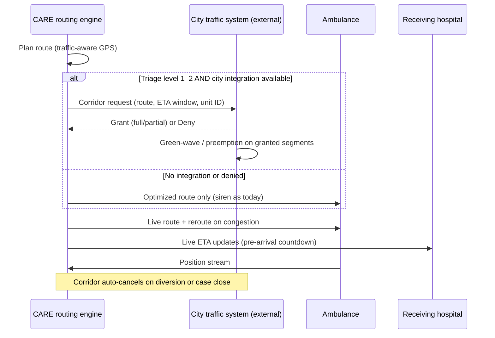

**Boundary:** CARE **requests**; the city system **decides**. Partial grants are normal (corridor on arterials, not on side streets). All corridor requests are logged for the city's own audit.

---

#### UC-09 · Hospital pre-arrival & handover

1. On dispatch (UC-07), the receiving hospital's console shows an incoming card: triage color, ETA countdown, chief complaint, vitals trend sparkline, Emergency Summary, bed hold.
2. Charge nurse acknowledges → assigns team; team members get pinged with the packet.
3. Diversion path: if the hospital's state collapses meanwhile (e.g., resus bed lost), it can request diversion → dispatch re-runs selection → new hold placed → old hold released → paramedic rerouted with reason. Diversions are counted per facility (registry accuracy accountability).
4. Handover: paramedic's en-route observations and interventions merge into the encounter; ER re-triages with the *same* engine (any delta from field triage is displayed with reasons); case closes on admission/discharge decision.

---

### Group C :  Mass-casualty incident (MCI)

---

#### UC-10 · MCI declaration → field triage → multi-hospital distribution

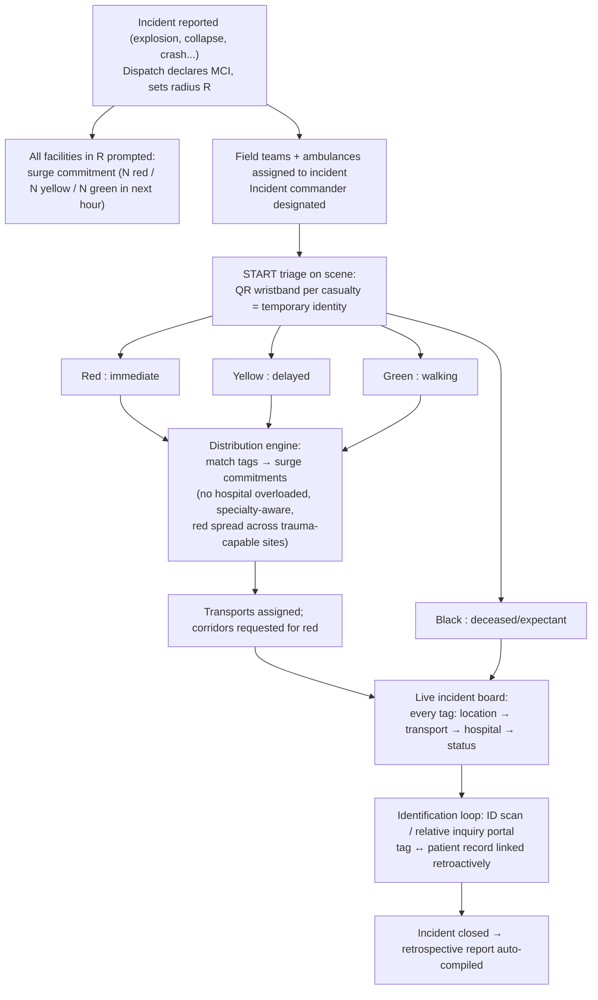

**START triage in the paramedic app:** the tag flow is optimized for < 30 s per casualty :  color, approximate age band, mobility, major injury category, photo (optional). Everything else waits.

**Distribution rules (the core MCI algorithm):**

- Never send more reds to a hospital than its committed red surge.
- Prefer specialty match for reds (trauma center, burns unit) even at ETA cost within a bound.
- Greens go *away* from the trauma centers (protect red/yellow capacity) :  to clinics and secondary facilities.
- Family co-location as a soft constraint for greens (identified minors routed with an identified parent when possible).

**The identification loop:** relatives call a public inquiry line/portal; operators match descriptions/photos against tags; on match, the tag links to the patient record :  and the hospital treating that tag *instantly* gains the medical history mid-treatment. This is one of CARE's highest-value moments.

---

#### UC-11 · MCI live command board

The incident commander's single screen: map of scene sectors; per-tag pipeline status (tagged → awaiting transport → en route → arrived → treated); per-hospital load vs. commitment gauges; ambulance positions; unassigned-red alarm (any red without a transport assignment for > X min flashes). All updates are event-driven from paramedic apps, ambulance GPS, and hospital consoles :  the board is a *view*, not a data-entry surface, so it stays truthful under chaos.

---

### Group D :  Cross-cutting flows

---

#### UC-12 · Break-glass access :  see §7.4 (sequence diagram there).

#### UC-13 · Care-circle management

Invite by phone/QR → invitee accepts → patient assigns tier (T0/T1) → revocable anytime, one tap. Minors: guardians hold T1–T2 by default until majority, then control flips to the patient. An adult patient's tiers are never silently upgraded :  every change notifies the patient.

#### UC-14 · Capacity update (adapter + manual) :  see §5.4.

Adapter path: HIS event (admit/discharge/transfer) → Capacity Adapter → registry (seconds). Manual path: tablet console → registry with freshness stamp → staleness decay → dispatch sees the timestamp on every number it trusts.

#### UC-15 · Sealed-section grant

Patient opens Privacy Center → sees sealed domains → grants a named clinician T3 on one domain → clinician notified → grant listed and revocable. Every T3 read is logged and visible to the patient ("Dr. X viewed your psychiatric history on ...").

#### UC-16 · Post-incident / post-case review

Case closes → auto-compiled timeline (all events, timestamps, decisions, overrides, break-glass uses) → available to: the patient (their own cases), facility QA, dispatch QA, and :  de-identified :  to the model-evaluation pipeline (triage accuracy vs. outcome; diagnosis-assist agree/disagree analysis).

---
## 10. State Machines

### 10.1 Emergency case lifecycle

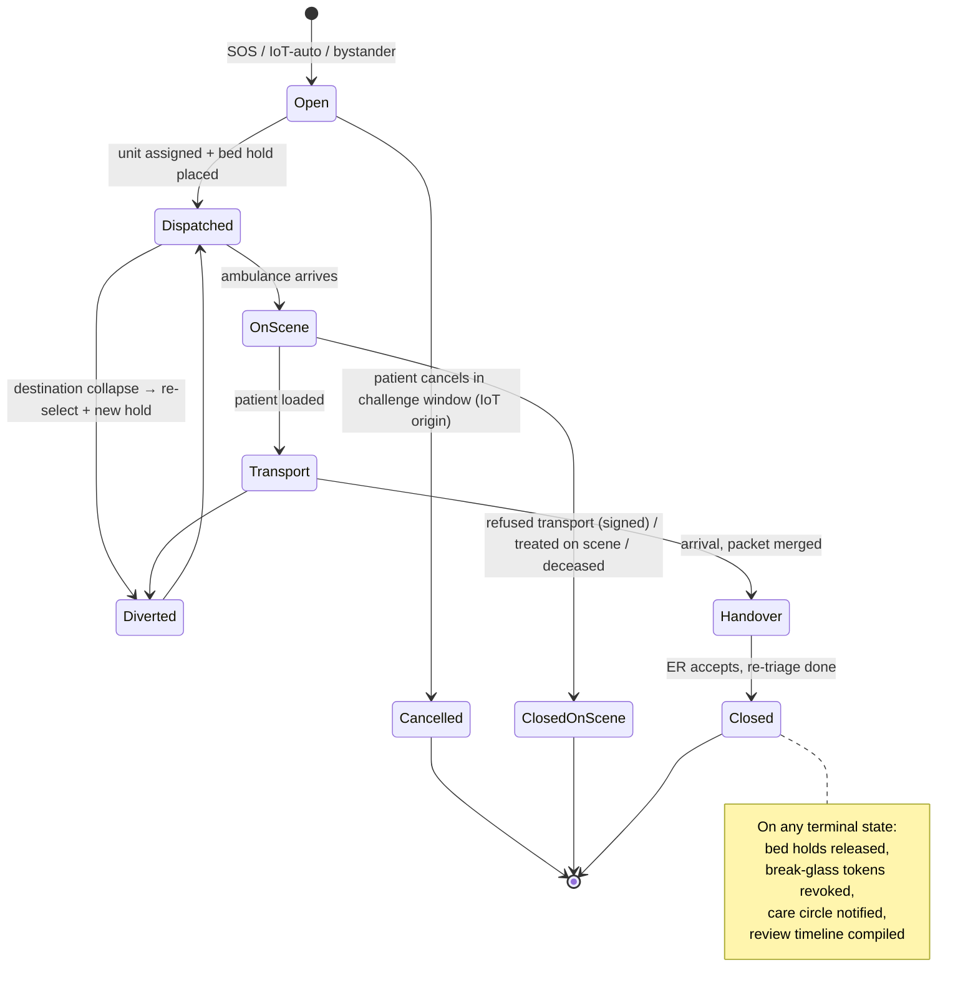

### 10.2 Bed states

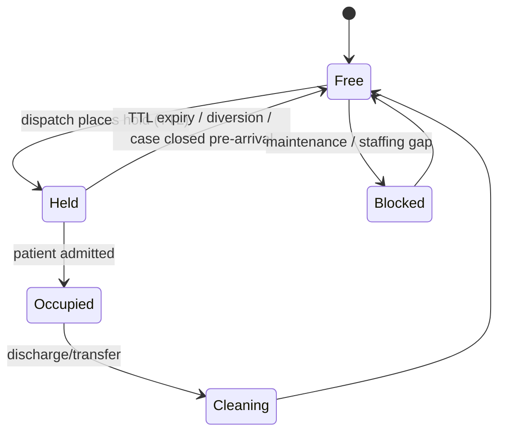

### 10.3 MCI incident lifecycle

`Declared → Surge-collection (parallel with field response) → Active (tagging/distribution/transport loops) → Winding-down (no untransported red/yellow) → Closed (all tags at terminal status) → Retrospective published.` Re-escalation allowed: a Winding-down incident returns to Active if a secondary event occurs (e.g., structure collapse aftershock).

---

## 11. Edge Cases & Failure Modes

The design treats failure handling as first-class, not an appendix. The system is safety-critical; every subsystem has a defined degraded mode.

| # | Failure / edge case | Designed behavior |
|---|---|---|
| E1 | **No beds anywhere in range** | Dispatch widens radius automatically; if still none, "least-bad" overload protocol: nearest ER takes the patient with an overload flag, regional coordinator alerted. The system never answers "no destination." |
| E2 | **Patient device offline / battery dead** | Technical alert (low urgency) to patient + T1; monitoring rules pause with an explicit "blind since HH:MM" marker on the doctor's watch-list :  silence is never displayed as "normal." |
| E3 | **False IoT alarm** | Challenge window (UC-03); post-cancel rule review; repeated pattern → device-fit check appointment, never silent desensitization. |
| E4 | **Patient refuses transport** | Paramedic records refusal (signed on device); triage level + refusal to record; treating doctor + T1 notified; case closes `refused` with a follow-up task auto-created. |
| E5 | **Unidentified casualty** | Case runs on the tag/temporary ID (nullable patient link, §8); Emergency Summary unavailable → CDS runs in "unknown-history" mode (conservative dosing, allergy-unknown flags); identification loop links retroactively. |
| E6 | **Network partition :  ambulance offline** | Paramedic app is offline-first: case packet cached at dispatch time; observations queue locally and sync on reconnect; triage tags (MCI) work fully offline with QR as the key. |
| E7 | **Network partition :  hospital adapter down** | Registry marks facility stale; dispatch sees timestamps; facility falls back to manual console (§5.4). |
| E8 | **Smart-city API down / deny** | Silent fallback to GPS routing + siren (UC-08); level-1 transport is never blocked waiting on a corridor. |
| E9 | **Triage engine unavailable** | Dispatch console falls back to a built-in manual triage form (standard protocol questions); cases flagged `manual_triage` for later review. AI assist degrades; humans always have a path. |
| E10 | **Diagnosis-assist model down** | Doctor workspace fully functional without it (it is assist, not gate). |
| E11 | **Conflicting triage scores** (self vs. dispatch vs. ER) | Never silently overwritten :  each stored with its input snapshot; deltas displayed with contributing-factor diff (§5.1). |
| E12 | **Two dispatchers, one bed** | Impossible by design: bed holds are strongly consistent single-holder (§5.4). |
| E13 | **Break-glass abuse attempt** (no active case) | Policy engine refuses :  grants are case-bound; there is no "browse mode" for sealed data at any privilege level. |
| E14 | **Sealed diagnosis vs. drug safety** | Safety override of §7.3: interaction fires without revealing the diagnosis. |
| E15 | **MCI overwhelms committed surge** | Distribution engine flags the gap to the incident commander with the exact deficit ("4 red over capacity"); regional mutual-aid request auto-drafted; commander decides. |
| E16 | **Duplicate case** (bystander + IoT auto for same event) | Geo-temporal dedup at intake: cases within radius/time window surfaced as "possible duplicate :  merge?"; operator confirms merge; both origins preserved on the merged case. |
| E17 | **Ambulance breakdown mid-transport** | Unit flags itself out-of-service → case auto-returns to selection with `in_progress` priority → nearest unit re-tasked → hospital ETA updated. |
| E18 | **Patient in another city/region** | Record is national-scope by design; dispatch is regional :  the case opens in the region of the *location*, record follows the patient. |

---

## 12. Non-Functional Requirements

| Category | Requirement |
|---|---|
| **Availability** | Emergency path (intake → triage → dispatch → routing) engineered for 99.99%; degraded modes defined for every dependency (§11). Clinical path 99.9%. |
| **Latency** | SOS → case visible in dispatch queue: < 3 s. Vitals device → alert evaluation: < 5 s. Capacity query at dispatch: < 500 ms. |
| **Consistency** | Bed holds and MCI surge commitments: strong consistency. Vitals streams: eventual (ordered per device). |
| **Scalability** | MCI mode is the sizing event: design for 500 simultaneous tags, 100 ambulances, 30 facilities per incident without degrading the individual-emergency path (separate queues/priorities). |
| **Security** | mTLS everywhere; per-device and per-user keys; sealed data encrypted with domain-separate keys; immutable append-only audit (hash-chained). |
| **Compliance posture** | Designed to satisfy GDPR-class principles (consent, access, erasure with medical-record legal-retention carve-outs) and to be mappable to regional health-data law; AI components positioned as clinical decision support (human-in-the-loop) per emerging medical-AI regulation. |
| **Auditability** | Every read of sealed data, every override, every break-glass, every triage-level lowering: logged with actor + reason, patient-visible where applicable. |
| **Interoperability** | EHR speaks FHIR at its boundary; observations LOINC-coded; diagnoses ICD; symptoms SNOMED :  so CARE can exchange with existing hospital systems rather than demanding replacement. |
| **Offline resilience** | Paramedic and MCI tagging apps offline-first; patient app caches the Emergency Summary locally (readable by responders via lock-screen medical ID even with no network). |

---

## 13. Design Decisions Log

Decisions taken during design, with rationale :  recorded so future work challenges them consciously.

| ID | Decision | Alternatives considered | Rationale |
|---|---|---|---|
| **D1** | Diagnosis-assist outputs a **ranked differential with evidence**, addressed to the clinician; human records the final diagnosis; both stored & linked. | (a) Single diagnosis + confidence; (b) autonomous diagnosis. | A ranked list matches clinical reasoning (differential diagnosis), avoids anchoring on one answer, and is medico-legally defensible as decision support. Autonomy rejected: liability, regulation, and safety. |
| **D2** | CARE builds **no IoT hardware** :  an open protocol + certification, server-side clinical alarm logic. | Building own devices; per-vendor integrations. | Vendor-agnostic standard scales (any manufacturer can join), keeps safety logic consistent across device brands, and matches the team's software scope. |
| **D3** | Capacity registry: **adapter-first, manual-fallback**, with freshness stamps and staleness decay. | Manual only; adapter only. | Adapter-only excludes smaller clinics; manual-only is too stale for dispatch decisions. Hybrid with visible freshness lets dispatch calibrate trust. |
| **D4** | Smart-city: **request/grant corridor protocol**, city stays authoritative; GPS routing always-on fallback. | Direct signal control by CARE; GPS only. | Direct control is a governance and safety non-starter; GPS-only wastes the smart-city opportunity for red transports. Request/grant is deployable city-by-city. |
| **D5** | Break-glass: treating physician or senior dispatch may invoke; paramedics request under a two-person rule; grants time-boxed, case-bound, domain-scoped; patient notified post-case. | Any responder self-serves; physicians only. | Balances field reality (paramedics need data fast) against abuse risk; two-person rule + audit + patient notification create accountability without blocking care. |
| **D6** | One **shared triage engine** with asymmetric override (humans raise freely, lowering needs a reason). | Independent triage per surface. | Consistency across patient/dispatch/hospital; the asymmetry encodes "fail toward safety." |
| **D7** | `EMERGENCY_CASE` identity is **nullable**; MCI casualties keyed by physical QR tags. | Require identification first. | Emergencies do not wait for identity; retroactive linking preserves both speed and record continuity. |

---

## 14. Future Work

- **Predictive dispatch** :  pre-position ambulances using historical incident density + events calendar + weather.
- **Tele-triage video** :  dispatch operator video into the scene during the challenge window / bystander calls.
- **Cross-region federation** :  protocol for two CARE deployments (or CARE ↔ foreign system) to exchange a traveling patient's record with consent.
- **Population health layer** :  de-identified early-warning signals (e.g., respiratory-alert clustering as outbreak detection) for public-health authorities.
- **Drone first-response** :  AED/naloxone drone dispatch for level-1 cases where drone ETA < ambulance ETA; same dispatch engine, new unit type.
- **Formal verification of the safety core** :  model-check the bed-hold consistency and break-glass policy engine.

---

*End of design document :  CARE IHS v1.0.*

