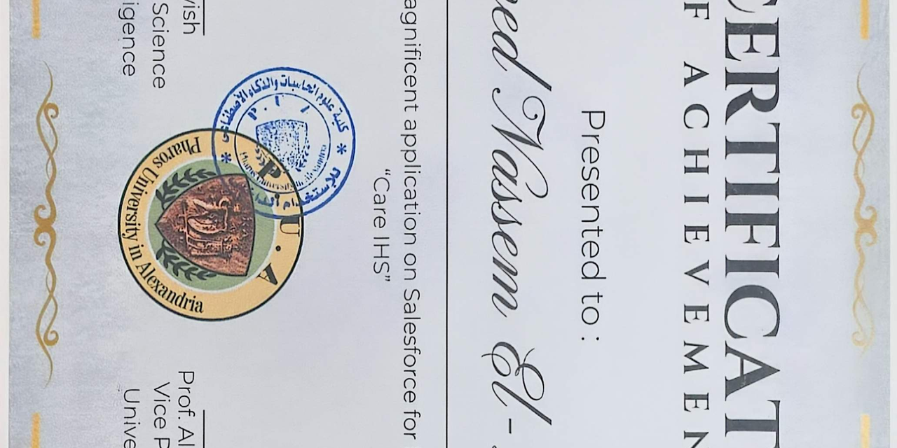

# CARE :  Integrated Health System

## System design document

**Status:** Design phase :  no implementation.
**Author:** Ahmed Eldaly :  September 2026.
**Live write-up:** https://ahmednassem.com/designs/care-ihs/

A city-wide health platform: unified records, an open device protocol, AI
triage, and emergency dispatch as one system.

## What this repository contains

This repo holds the **design document only**. There is no code, no running
service, and no clinical deployment.

- `CARE-IHS-Design.md` :  the full design document (14 sections, ~12 000
  words): vision, scope, actors, architecture, the five core engines, the
  CARE Device Protocol, privacy model, ERD, complete use-case catalog, state
  machines, edge cases, NFRs, decisions log, and future work.
- `Logo_Maker_com_ist_logomaker_20260913_202541_795.png` :  the project's
  logomark (used on the live write-up).

## The one-paragraph summary

Healthcare systems and emergency-response systems are traditionally **two
separate worlds**. A hospital knows a patient's history but not that an
ambulance is four minutes away carrying them. Civil defense dispatches an
ambulance to a cardiac arrest without knowing the patient is diabetic,
allergic to penicillin, and wears a connected heart monitor that flagged the
arrhythmia 90 seconds before collapse.

**CARE (Connected Ambulance :  Records :  Emergency) :  Integrated Health
System** fuses these worlds into one platform built on three pillars:

1. **Continuous care** :  a unified electronic health record (EHR) fed live by
   patient IoT devices, connecting patients, relatives, doctors, clinics, and
   hospitals.
2. **Intelligent assistance** :  a trained AI model that sees the *full* patient
   context (record + live vitals + presenting complaint) and produces a
   preliminary diagnosis and risk score as **decision support for clinicians,
   never as an autonomous final decision**.
3. **Emergency integration** :  civil defense dispatch, ambulance routing,
   smart-city traffic corridors, real-time hospital capacity, and
   mass-casualty coordination, all reading from and writing to the same data
   core.

The system's defining property: the **same data and the same triage logic
serve everyday care and disaster response**. There is no "emergency copy" of
the patient. The ambulance, the ER, and the family doctor all see one record,
filtered by permissions.

## The five core engines

1. **Records engine** :  the unified EHR (longitudinal, patient-controlled
   permissions).
2. **Devices engine** :  the open CARE Device Protocol: any vendor can stream
   vitals; the gateway and cloud handle anomaly detection.
3. **Triage engine** :  the AI risk score that the patient app, dispatch, and
   hospital consoles all call on the same data, so the three never silently
   disagree.
4. **Hospital ops engine** :  bed/capacity management, staff allocation, and
   pre-arrival notification.
5. **Dispatch engine** :  civil defense routing, smart-city corridors,
   mass-casualty coordination, and bed holds with TTL.

## Three design decisions the document elaborates

- **One shared triage engine.** The patient app, civil-defense dispatch, and
  hospital consoles all call the same AI triage engine on the same data, so
  the three systems can never silently disagree about how sick someone is.
- **Bed holds with TTL and a single holder.** When dispatch routes a critical
  patient to a hospital, it places a strongly consistent hold on a bed
  (TTL = ETA + 15 min). Two ambulances can never hold the same bed; expired
  holds auto-release.
- **Break-glass with a two-person rule.** Emergencies widen access through a
  controlled path, never by turning permissions off: field requests need
  dispatch or physician approval, every access is immutably logged, and the
  patient is notified after the case closes.

## Honest limit

The AI never diagnoses autonomously; it is decision support with the clinician
as final authority. And the design assumes networks fail: paramedic apps are
offline-first, and a silent patient device is shown as "blind since HH:MM",
never as "normal".

## Reading order

If you have 15 minutes: §1 Vision, §4 Architecture, §5 Core Engines,
§9.1-9.3 Use Cases.

If you have an hour: cover the rest of the table-of-contents in order.

## Status & how to engage

This is **design phase only**. No code, no clinical deployment. Issues and
design discussion belong in this repo's issue tracker; pull requests that
propose design changes are welcome as long as they cite the section they
affect.

For the full design write-up (~12 000 words, 14 sections including ERD,
state machines, use-case catalog, edge cases, NFRs, and decisions log), see
[EXPLANATION.md](EXPLANATION.md). It embeds the project logomark and the
scanned notebook notes that seeded the design.

## Author

Ahmed Eldaly :  ahmednassem.com

